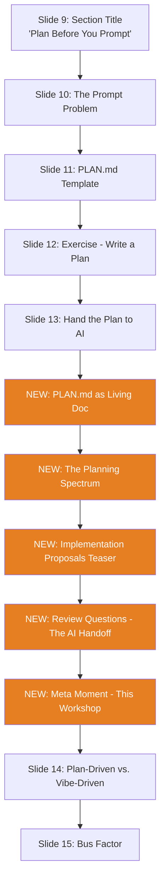

# IP-002: PLAN.md Usage & Proposal Methodology Slides

This proposal adds new slide content to the "Plan Before You Prompt" section (Section 1) that deepens the PLAN.md teaching. It introduces PLAN.md as the practical starting point, then teases the more sophisticated Implementation Proposals methodology as the "next level" for teams whose projects grow beyond quick scripts.

<!-- more -->

## Status

**Status**: Implemented
**Last Updated**: 2026-02-06
**Implementation**: Complete

## Problem Statement

The current Section 1 ("Plan Before You Prompt", Slides 9-15) introduces PLAN.md as a lightweight planning document and shows how to hand it to AI. This is effective for the core message, but it has gaps:

- **No guidance on PLAN.md lifecycle**: The audience learns to write a PLAN.md but not how to keep it alive — updating it during implementation, using it as a review artifact, or referencing it when onboarding a teammate.
- **No bridge to structured methodology**: Teams that adopt PLAN.md successfully will inevitably outgrow it. When they build multi-phase projects with multiple contributors, they need something more formal. The workshop currently offers no "what's next" path.
- **The Implementation Proposals methodology exists but is invisible**: This very repository uses a proposal-first methodology (documented in `docs/IMPLEMENTATION_PROPOSALS.md`) with structured templates, lifecycle tracking, Review Questions, and AI-agent integration. The audience never learns this exists.
- **Missed "eat your own dogfood" opportunity**: The workshop is itself built using the proposal system (IP-001 designed the slides). Showing this to the audience would powerfully demonstrate the methodology in action — "the slides you're watching right now were planned using the system I'm about to show you."

**Who is affected**: Workshop attendees who adopt PLAN.md but lack a clear upgrade path when their projects become more complex.

**Consequences of not addressing**: Attendees hit a ceiling with PLAN.md and either abandon planning entirely ("this doesn't scale") or reinvent a worse version of what Implementation Proposals already solves.

## Proposed Solution

### Overview

Add 4-6 slides to Section 1 that expand the PLAN.md coverage in two layers:

1. **Layer 1 (practical)**: How to actually use PLAN.md day-to-day — keeping it updated as reality diverges from the original plan.
2. **Layer 2 (conceptual + live demo)**: Introduction to the Implementation Proposals methodology as the structured "next level" — showing the lifecycle and the Review Questions concept at a conceptual level. The speaker demonstrates the methodology live by screen-sharing real proposals from their own projects and from this very presentation (IP-001).

The slides should maintain the workshop's conversational tone and non-engineer audience. The proposal methodology is presented as an aspirational model, not a requirement. The slides stay conceptual; the speaker provides the practical depth through live screen share.

### Key Components

1. **PLAN.md as a Living Document** (Slide A) — Slide teaching that PLAN.md isn't "write once and forget" but should be updated during and after implementation. Bridges from the PLAN.md basics into the scaling conversation.
2. **The Spectrum of Planning** (Slide B) — Visual showing the progression from no plan → PLAN.md → Implementation Proposals → full RFC/ADR process
3. **Implementation Proposals Teaser** (Slide C) — Conceptual overview of the IP methodology with its lifecycle diagram. No template walkthrough — the speaker demonstrates by screen-sharing real proposals from their own projects.
4. **Review Questions — The AI Handoff** (Slide D) — Conceptual explanation of how AI generates structured questions that force human decision-making, illustrated with one visual example box.
5. **Meta Moment** (Slide E) — Matter-of-fact demonstration that these very slides were designed using the IP methodology. Speaker screen-shares IP-001 live as proof.

### Architecture



New slides are inserted after "How to Hand the Plan to AI" (current Slide 13) and before "Plan-Driven vs. Vibe-Driven Results" (current Slide 14). This placement works because:

- The audience already understands PLAN.md's basic structure
- They've seen how to give it to AI
- Now we deepen: "here's how to keep it alive and here's what it looks like when you scale this up"
- The arc flows naturally: write → hand to AI → keep alive → scale up → proof it works → why it matters
- Then we return to the comparison slide that closes the section

## Detailed Slide List

### NEW Slide A: PLAN.md Is a Living Document

**[Layout: default]**

**Content:**

```
PLAN.md isn't a tombstone — it's a journal.
```

Three-phase diagram:

```
BEFORE building        DURING building         AFTER building
┌─────────────┐       ┌─────────────┐        ┌─────────────┐
│ Write the    │       │ Update when │        │ Record what │
│ plan         │  ──→  │ reality     │  ──→   │ was actually│
│              │       │ diverges    │        │ built       │
└─────────────┘       └─────────────┘        └─────────────┘
```

Key points:
- The AI discovered the API returns data in a different format? **Update the plan.**
- You decided to skip a feature? **Note it in the plan.**
- The finished tool works differently than planned? **The plan reflects reality, not fantasy.**

🎤 **Speaker Notes:**
"Now that you know how to write a plan and hand it to AI, let me tell you the one thing most teams get wrong — they never update the plan. They write it, hand it to Claude, and never look at it again. Then six months later someone reads PLAN.md and it describes a completely different tool than what exists. The plan is only useful if it stays true. When reality changes — and it ALWAYS changes — update the plan. Think of PLAN.md as a journal, not a contract. It evolves with your project. And this idea — keeping the document alive, updating it as you go — becomes even more important when your projects get bigger. Which brings me to something I want to show you..."

### NEW Slide B: The Planning Spectrum

**[Layout: default]**

**Content:**

```
← Quick & Light                                    Structured & Thorough →

 No Plan        PLAN.md          Implementation       Full RFC / ADR
                                 Proposals
    ↓               ↓                 ↓                     ↓
 "Just vibe"   "20 lines of     "Structured doc       "Enterprise-grade
               what, why, how"   with lifecycle,       design records"
                                 alternatives,
                                 review questions"

     🏠              🏡                🏢                    🏗️
 Weekend hack   Team script      Multi-phase           Production
                                 project               system
```

"You don't jump from no plan to enterprise RFC. You grow into it."

🎤 **Speaker Notes:**
"Planning isn't binary — it's a spectrum. For a quick script, PLAN.md is perfect. Twenty lines, five minutes, done. But what happens when your tool grows? When it has multiple phases, multiple contributors, and decisions that affect the whole team? That's when you need something more structured. I want to show you what that looks like — not because you need it today, but because you'll recognize the moment when you do."

### NEW Slide C: Implementation Proposals — The Next Level

**[Layout: two-cols]**

**Content:**

**PLAN.md (you know this)**
```
Quick, informal, 20 lines
One person writes it
Lives in project root
Great for: scripts, small tools
```

**Implementation Proposal (the next level)**
```
Same idea — think before you build
But with more structure:

✓ Problem: what are we solving?
✓ Solution: how?
✓ Alternatives: what else did we consider?
✓ Trade-offs: what could go wrong?

Has a lifecycle:
Draft → Review → Accepted → Implemented
```

Lifecycle diagram:
```
Draft  →  Under Review  →  Accepted  →  Implemented
                ↓
            Rejected
```

🎤 **Speaker Notes:**
"An Implementation Proposal is PLAN.md's big sibling. Same core idea — think before you build — but with more structure. Instead of 20 freeform lines, you have defined sections that force you to think about alternatives and risks. And it has a lifecycle — the proposal goes through review before anyone writes code. You don't need to memorize these sections. I want to show you what this actually looks like in practice."

**[Speaker: switch to live screen share. Open a real Implementation Proposal from your own project. Walk through the sections briefly — 60-90 seconds. Point out: 'See? Problem, Solution, Alternatives, Trade-offs. That's it. The AI wrote this draft, I reviewed it.' Then switch back to slides.]**

### NEW Slide D: Review Questions — The AI Handoff

**[Layout: default]**

**Content:**

The key innovation: **AI writes the proposal, then reviews its own work.**

```
Step 1: You say "Write a proposal for feature X"
Step 2: AI writes the full proposal
Step 3: AI re-reads its own proposal and asks:

┌──────────────────────────────────────────────┐
│ Q1: Data Storage Choice                      │
│                                              │
│ Issue: Proposal says "store in CSV" but      │
│ also mentions "complex queries needed"       │
│                                              │
│ Question: Should we use SQLite instead?      │
│                                              │
│ Options:                                     │
│   A) CSV files (simple, portable)            │
│   B) SQLite (queryable, still single file)   │
│   C) PostgreSQL (if team access needed)      │
│                                              │
│ Answer: _________ ← YOU fill this in        │
└──────────────────────────────────────────────┘
```

**The AI doesn't know what it doesn't know. But it CAN find its own contradictions.**

🎤 **Speaker Notes:**
"This is my favorite part of the whole methodology. After the AI writes a proposal, it reads it back and generates questions — structured questions with options — about things that don't quite add up. The AI found a contradiction? It asks you. The AI isn't sure about a design choice? It gives you options. You — the human — make the final call. This is the handoff. The AI does the heavy lifting, but YOU make the decisions. It's like having a junior architect who drafts the blueprints and then says 'hey boss, I noticed three things that don't quite work — which way should we go?'"

### NEW Slide E: These Slides Were Planned This Way

**[Layout: center]**

**Content:**

"The slides you're watching **right now** were designed using this exact system."

- IP-001 proposed the full slide structure, speaker notes, and section order
- AI (Claude) wrote the first draft
- AI generated 5 Review Questions (language, slide count, demo strategy, humor level, section order)
- I answered each question
- AI applied the resolutions and built the slides

"I used this system to build what you're watching. It works."

🎤 **Speaker Notes:**
"By the way — this presentation was designed using the exact methodology I just showed you. I didn't just open Claude and say 'make me slides.' I wrote a proposal — IP-001 — that defined every section, every slide, every speaker note. The AI drafted it, then generated five review questions: should the slides be in English or Slovak? How many slides? What's the demo strategy? I answered each one, the AI updated the proposal, and then implemented it. The result is what you're looking at. Let me show you the actual document."

**[Speaker: switch to live screen share. Open `docs/proposals/posts/ip-001-presentation-structure-and-slide-list.md`. Scroll through it briefly — show the Problem Statement, the Detailed Slide List, the Review Questions with filled-in answers. Point out: 'See Q1? I said English slides, Slovak speaking. Q4? I said keep all the jokes. These decisions shaped what you're watching right now.' Keep it to 60-90 seconds. Switch back to slides.]**

## Implementation Plan

### Phase 1: Slide Content

- [ ] Write the 5 new slides in Slidev markdown format
- [ ] Insert them into `slides.md` after the current "How to Hand the Plan to AI" slide
- [ ] Ensure transitions and layout consistency with surrounding slides
- [ ] Add `v-click` animations where progressive reveal improves comprehension

### Phase 2: Visual Elements

- [ ] Create the Planning Spectrum visual (ASCII art or Mermaid)
- [ ] Create the Review Questions box visual
- [ ] Ensure the lifecycle diagram renders cleanly in Slidev

### Phase 3: Speaker Notes & Live Demo Prep

- [ ] Write detailed speaker notes for all 5 slides with timing cues
- [ ] Add live screen share cues to Slides C and E speaker notes
- [ ] Ensure speaker has real IP proposals ready to show (this repo's IP-001, plus optionally IPs from other projects)
- [ ] Add audience interaction prompts where natural
- [ ] Include bridging language in Slide A connecting backward to "Hand to AI" and forward to the spectrum

### Prerequisites

- IP-001 must be implemented (it is — slides exist)
- Understanding of current slide numbering (new slides will shift subsequent numbers)
- Speaker has access to at least one real project using the IP methodology (this repo qualifies)

## Technical Details

### Slide Placement

New slides insert between current Slide 13 ("How to Hand the Plan to AI") and current Slide 14 ("Plan-Driven vs. Vibe-Driven Results"). This shifts all subsequent slide numbers by 5.

Updated slide count: ~70 slides (was ~65).

### Slidev Features Used

- `layout: two-cols` for the PLAN.md vs. IP comparison (Slide C)
- `layout: center` for the meta moment (Slide E)
- `v-click` for progressive reveal of the Review Questions box (Slide D)
- Standard `<!-- -->` for speaker notes

### Live Demo Dependencies

Slides C and E include speaker note cues for live screen share. The speaker needs:
- This repository open in an editor/browser to show IP-001
- Optionally, a second project with real IPs to show broader usage
- The live demo segments are kept to 60-90 seconds each — they supplement the conceptual slides, not replace them

### References to Existing Files

The slides stay conceptual and don't duplicate methodology docs. The speaker shows these live:
- `docs/proposals/posts/ip-001-presentation-structure-and-slide-list.md` — the real example used in the meta moment (Slide E live demo)
- Any IP from the speaker's own projects — used during Slide C live demo
- `docs/IMPLEMENTATION_PROPOSALS.md` — available if the audience asks for more detail (not shown by default)

## Alternatives Considered

### Alternative 1: Separate Section for Implementation Proposals

**Description**: Create a new Section 1.5 dedicated entirely to the IP methodology, with 8-10 slides.

**Pros:**
- More thorough coverage
- Could include a live exercise (audience writes a mini-proposal)

**Cons:**
- Adds 15-20 minutes to an already tight schedule
- Risks overwhelming non-engineer audience with process
- The audience doesn't need IPs today — they need PLAN.md today

**Why not chosen**: The goal is to plant a seed, not teach the full methodology. 5 slides as a teaser within the existing section is the right weight.

### Alternative 2: Only Mention IPs in the Closing Section

**Description**: Add a single "What's Next" slide in the wrap-up that mentions IPs as an advanced practice.

**Pros:**
- Minimal disruption to current flow
- Keeps Section 1 focused on PLAN.md

**Cons:**
- The audience won't understand what IPs are from a single mention
- Loses the powerful Review Questions concept
- Misses the meta moment opportunity

**Why not chosen**: A single mention doesn't give enough context for the audience to understand the value. The 5-slide treatment provides enough context to be meaningful without being overwhelming.

### Alternative 3: Replace PLAN.md with Implementation Proposals Entirely

**Description**: Teach IPs as the primary planning method from the start.

**Pros:**
- More rigorous methodology from day one
- Consistent with this repo's own practices

**Cons:**
- Way too heavy for the audience level
- IPs require understanding of concepts (alternatives, trade-offs, success criteria) that the audience hasn't learned yet
- Would kill the "just write 20 lines" simplicity that makes PLAN.md accessible

**Why not chosen**: PLAN.md's simplicity is its strength for this audience. IPs are aspirational, not prescriptive.

## Trade-offs and Risks

### Trade-offs

- **Depth vs. time**: Adding 5 slides extends Section 1 by approximately 10-12 minutes. This is acceptable given the author's stated preference for maximum material (IP-001 Q2 resolution: "Make as much material as possible — I can manage it in real time").
- **Simplicity vs. completeness**: The IP methodology is rich (Review Questions, lifecycle, changelog tracking, index management). We deliberately keep slides conceptual, focusing only on the ideas that create "aha" moments. The practical depth comes from the speaker's live demo of real proposals, not from slide content.
- **Self-reference**: The meta moment (Slide E) shows that these very slides were planned using the IP methodology. Delivered matter-of-factly ("I used this system to build what you're watching") rather than as a dramatic reveal, matching the speaker's direct presentation style. The live screen share of IP-001 makes it concrete rather than hand-wavy.

### Risks

| Risk | Impact | Mitigation |
|------|--------|-----------|
| Audience loses interest during methodology explanation | Medium | Slides stay conceptual; speaker switches to live demo of real proposals to keep it tangible. Speaker can skip if energy drops. |
| "This looks too complex for us" reaction | Medium | Frame explicitly as aspirational: "You don't need this today. You'll know when you do." No template walkthrough on slides — just concepts. |
| Meta moment falls flat | Low | Delivered matter-of-factly with live screen share of IP-001. The factual claim stands on its own even without audience enthusiasm. |
| Live demo fails (projector, file not found) | Low | Slides are self-contained and work without the live demo. The demo adds depth but isn't required for comprehension. |
| New slides disrupt flow of Section 1 | Low | Bridging speaker notes on Slide A connect backward ("you just learned to write and hand off a plan") and forward ("here's what happens when you scale up"). Arc tested: write → hand off → keep alive → scale up → proof → why it matters. |

## Success Criteria

- [ ] 5 new slides implemented in `slides.md` with speaker notes
- [ ] Planning Spectrum visual clearly communicates the progression
- [ ] Review Questions concept is understandable to a non-engineer in under 2 minutes
- [ ] Meta moment references IP-001 accurately
- [ ] Existing slide flow is preserved — new slides feel like a natural deepening, not an interruption
- [ ] Total Section 1 duration remains under 35 minutes with new content

## Future Considerations

- **Hands-on proposal exercise**: In a future workshop version, add an exercise where the audience writes a mini Implementation Proposal for their PPC tool using a simplified template
- **Proposal template handout**: Create a simplified IP template (fewer sections than the full `.template.md`) as a takeaway for teams ready to level up
- **Link to methodology docs**: If the workshop slides are hosted publicly, add a QR code linking to `docs/IMPLEMENTATION_PROPOSALS.md` for interested attendees

## References

- [IP-001: Presentation Structure & Complete Slide List](ip-001-presentation-structure-and-slide-list.md)
- [Implementation Proposals Methodology](../../IMPLEMENTATION_PROPOSALS.md)
- [Proposal Template](../.template.md)
- [Proposals Index](../index.md)

## Discussion

### Why PLAN.md First, IPs Second

The pedagogical structure mirrors how real teams adopt planning practices:

1. Start with something so simple it's hard to refuse (PLAN.md = 20 lines)
2. Experience the benefit (AI produces better output, teammates understand your work)
3. Hit a limit ("this plan isn't capturing our alternatives and trade-offs")
4. Discover the structured version exists (Implementation Proposals)
5. Adopt incrementally

This mirrors the workshop's overall philosophy: "You don't have to be at the far right of the spectrum. Moving even slightly from the left makes a HUGE difference."

### Why Review Questions Get Their Own Slide

The Review Questions mechanism is the single most distinctive aspect of the IP methodology. It solves a problem the audience will immediately recognize: "how do I trust what the AI wrote?" The answer — "make the AI question its own work, then you decide" — is both novel and practical. It deserves dedicated slide real estate.

### The Meta Moment as Proof

Showing IP-001 as a real example is more persuasive than any hypothetical. The audience is literally experiencing the output of the methodology. This turns abstract process into concrete evidence: "this system produced the thing you're watching." The live screen share of IP-001 makes this tangible — the audience sees real Review Questions with real answers, not a hypothetical box on a slide. Delivered matter-of-factly per the speaker's style, not as a dramatic reveal.

### Conceptual Slides + Live Demo = Best of Both Worlds

The resolved approach keeps slides clean and conceptual (no template walkthrough, no "how to write one" instructions) while the speaker provides practical depth through live screen share of real proposals. This means:
- Slides work standalone (e.g., when someone browses the hosted deck later without the speaker)
- The live session adds a layer that can't be captured in slides — scrolling through a real 200-line proposal, pointing at real Review Questions, showing real resolved answers
- The speaker controls depth in real time — 60 seconds if the audience gets it, 3 minutes if they're curious

## Review Questions

**Note**: This section is REQUIRED for AI-created proposals. Human-authored proposals may include it if needed.

**Status**: ✅ Resolved
**Review Date**: 2026-02-06
**Reviewer**: Claude AI (Opus 4.6)

The following questions must be answered before implementation:

---

### Q1: Depth of Implementation Proposals Coverage

**Issue**: The proposal adds 5 slides covering both PLAN.md lifecycle and the IP methodology. The IP content (Slides C, D, E) could range from "here's what it looks like" (conceptual) to "here's how to write one" (practical). The audience is non-engineers who just learned PLAN.md exists 10 minutes ago.

**Context**: Too much detail risks overwhelming the audience and undermining the simplicity message ("just write 20 lines"). Too little detail makes the IP mention feel like an unexplained aside. The right balance determines whether the audience leaves inspired or confused.

**Question**: How deep should the IP methodology coverage go?

**Options**:
- [X] **A**: Conceptual only — show the lifecycle diagram, explain Review Questions as a concept, do the meta moment. No template walkthrough, no "how to write one." (recommended — plants the seed without overwhelming)
- [ ] **B**: Light practical — show a simplified template alongside the concepts, briefly walk through one section (e.g., Alternatives Considered). Still aspirational framing.
- [ ] **C**: Full practical — include a mini-exercise where the audience sees the full template and discusses which sections they'd use. Adds ~5 more minutes.

**Answer**:
```
Make it conceptual - I will show it on my projects and this presentation - where we use implementation proposals.
```

**Resolution**:
```
Keep Slides C, D, and E strictly conceptual. No template walkthrough, no "how to write
one" instructions. Slide C shows the PLAN.md vs. IP comparison as a high-level overview
(what sections exist, the lifecycle diagram) without diving into how to fill them out.
Slide D explains Review Questions as a concept with one visual example box — not a
tutorial. Slide E is the meta moment where the speaker shows this presentation and their
own projects as live proof the methodology works. The speaker will do the "practical"
part live by pulling up real IPs from their own projects on screen, not through
slide content. Update speaker notes on Slides C and E to explicitly cue the speaker:
"This is where you switch to a live screen share of your actual project proposals."
```

---

### Q2: Meta Moment Placement

**Issue**: The "these slides were planned with IP-001" reveal (Slide E) is currently the last of the new slides, placed right before the Plan-Driven vs. Vibe-Driven comparison. An alternative would be to save it for the workshop's closing section (Slide 60-65 area) as a callback.

**Context**: Placing it in Section 1 creates an immediate "whoa" moment while the planning topic is hot. Placing it in the closing creates a narrative bookend ("remember when I said plan first? Here's proof I did"). Both have merit.

**Question**: Where should the meta moment live?

**Options**:
- [X] **A**: In Section 1 after the IP explanation (as proposed) — immediate impact while planning is the topic (recommended)
- [ ] **B**: In the closing section as a callback — stronger narrative bookend
- [ ] **C**: Both — brief mention in Section 1 ("by the way, these slides were planned this way"), full reveal in closing

**Answer**:
```
I am no Steve Jobs for surprising closing sections. 
```

**Resolution**:
```
Keep the meta moment in Section 1 (Slide E) as proposed. No closing callback. The
speaker's self-described style favors immediate, straightforward delivery over deferred
reveals. Slide E stays in position after the IP explanation (Slide D), right before the
Plan-Driven vs. Vibe-Driven comparison. Speaker notes should frame it matter-of-factly
("I used this system to build what you're watching") rather than as a dramatic twist.
No changes needed to the closing section.
```

---

### Q3: PLAN.md Lifecycle Slide — Is It Needed?

**Issue**: Slide A ("PLAN.md Is a Living Document") teaches plan maintenance — updating during and after implementation. This is valuable advice but might be too process-oriented for the audience at this stage. They haven't even written their first PLAN.md yet; telling them about maintaining it might feel premature.

**Context**: On one hand, "write it and forget it" is a real failure mode. On the other hand, the audience needs to successfully write one PLAN.md first before worrying about updating it. The workshop's philosophy is "start with one habit."

**Question**: Should the PLAN.md lifecycle slide stay, be simplified, or be cut?

**Options**:
- [X] **A**: Keep as proposed — it's a one-slide message that prevents a predictable failure mode (recommended)
- [ ] **B**: Simplify to a single bullet point on the "Hand the Plan to AI" slide — mention it but don't dedicate a full slide
- [ ] **C**: Move to the wrap-up section as part of "ongoing habits" — when the audience is thinking about long-term practices
- [ ] **D**: Cut entirely — let them write one first, cover maintenance in a future session

**Answer**:
```
Make sure that the planning section plays together well.
```

**Resolution**:
```
Keep Slide A ("PLAN.md Is a Living Document") as a standalone slide. To ensure the
planning section plays together well, review the full slide sequence after all 5 new
slides are inserted: Template → Exercise → Hand to AI → Living Doc (A) → Spectrum (B)
→ IP Teaser (C) → Review Questions (D) → Meta Moment (E) → Plan-Driven vs. Vibe-Driven
→ Bus Factor. The arc should feel like a natural deepening: "here's how to write one"
→ "here's how to keep it alive" → "here's what it looks like when you scale up" →
"here's proof it works" → "here's why it matters." Slide A's speaker notes should
bridge explicitly: "Now that you know how to write a plan and hand it to AI, let me
tell you the one thing most teams get wrong — they never update the plan." This connects
backward to the exercise and forward to the scaling conversation.
```

---

**Instructions for completing Review Questions**:

1. For each question, check the box next to your chosen option
2. Fill in the "Answer" section with your reasoning
3. Fill in the "Resolution" section with specific changes to make
4. Update the proposal based on all resolutions.
5. Change Status to "✅ Resolved" when all questions answered. Remove the "Review Questions" after the document is accepted.
6. Add changelog entry: "Resolved review questions and updated proposal accordingly"

---

## Changelog

| Date | Author               | Changes |
|------|----------------------|---------|
| 2026-02-06 | jdubec               | Initial draft with 5 new slides, placement strategy, review questions |
| 2026-02-06 | Claude AI (Opus 4.6) | Resolved all 3 review questions based on author answers; IP coverage stays conceptual with live demo of real projects, meta moment stays in Section 1, lifecycle slide kept with bridging speaker notes |
| 2026-02-06 | Claude AI (Opus 4.6) | Applied all resolutions to proposal body: Slides C/E updated with conceptual framing and live demo cues, Slide E reframed as matter-of-fact, Slide A speaker notes updated with bridging language, Key Components reduced from 6 to 5, Implementation Plan updated with live demo prep, risks table updated. Status → Under Review |
| 2026-02-06 | Claude AI (Opus 4.6) | Status reconciliation (IP-004): draft → false, Status → Implemented, Implementation → Complete. Slides were already implemented. |