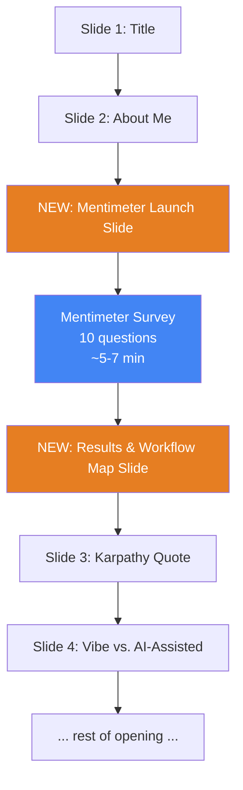

# IP-003: Audience Workflow Survey via Mentimeter

This proposal adds an interactive Mentimeter survey to the workshop opening, placed after the speaker introduction and before the main content begins. The survey serves as both an icebreaker and a real-time workflow profile of the audience, letting the speaker calibrate depth and pacing for the rest of the session.

<!-- more -->

## Status

**Status**: Implemented
**Last Updated**: 2026-02-06
**Implementation**: Slides added, Mentimeter survey ready

## Problem Statement

The workshop currently opens with a linear sequence: Title → About Me → Karpathy Quote → Vibe vs. AI-Assisted → Stats → Horror Stories → Roadmap. The speaker gets no structured signal about the audience's baseline knowledge until informal prompts ("raise your hand if...") scattered across early slides.

- **No calibration data**: The speaker doesn't know if the audience has never touched git or if half of them already use branches. This affects every section's pacing and depth.
- **Informal polls are weak signals**: "Raise your hand if..." prompts suffer from social pressure (nobody wants to be the only hand up or down), low participation, and no persistent data.
- **Cold start**: The audience sits passively through 7 slides before any interaction. By that point, energy and attention may already be dipping.
- **One-size-fits-all delivery**: Without knowing the room, the speaker either under-explains (losing beginners) or over-explains (boring people who already know git basics). Both are bad.

**Who is affected**: The speaker (can't calibrate), the audience (gets wrong-level content).

**Consequences of not addressing**: The speaker guesses the audience level and gets it wrong in at least some sections. Attendees mentally check out during content that's too basic or too advanced for them.

## Proposed Solution

### Overview

Add a **Mentimeter survey** (10 questions, ~5-7 minutes) to the workshop opening, placed after the "About Me" slide and before the Karpathy quote. The survey profiles the audience's current workflow — what tools they use, how they store data, what they build, where they host — giving the speaker a real-time map of the room's practices. Two new slides support the survey: a launch slide and a results/transition slide.

The survey doubles as an **icebreaker** — phones come out, energy kicks in, and the audience is engaged before the first real content slide. Since the audience already has baseline knowledge of vibecoding topics, the questions assume familiarity and focus on **"how do you currently do X?"** rather than **"do you know what X is?"**

### Key Components

1. **Mentimeter Survey** — 10 multiple-choice questions profiling: AI tool habits, planning practices, data storage (Excel/Sheets/databases), services used, tools in workflow, types of apps built, time investment, hosting, security practices, and self-assessment
2. **Launch Slide** — Slide showing the Mentimeter invitation link, QR code, and framing ("I want to learn about YOUR workflow")
3. **Results & Transition Slide** — Slide where the speaker maps the room's workflow profile and sets expectations for the session
4. **Question Design** — Questions designed to be fun, non-threatening, and genuinely informative — profiling real workflow habits with one humorous option each

### Architecture



**Placement rationale**: After "About Me" because the audience knows who's talking and is warmed up. Before the Karpathy quote because the quiz results inform how the speaker frames everything that follows. The quiz also serves as the icebreaker that the current opening lacks.

## Mentimeter Survey: Proposed Questions

> **Design principles**: Each question has 4 options that represent different workflow habits — there are no "wrong" answers. The goal is to map the room's current practices, not to test knowledge. Every question includes one humorous option (usually D) for icebreaker energy.

---

### Q1: AI Tools in Your Workflow

**"Which AI tool do you reach for most when building scripts or automations?"**

- A) ChatGPT / Claude — conversation-style, paste code back and forth
- B) Cursor / GitHub Copilot — AI built into the editor
- C) Google AI Studio / Gemini — prototyping and experiments
- D) I whisper to my laptop and hope for the best

**Purpose**: Maps the room's tooling landscape. Tells the speaker whether to emphasize conversation-based workflows (A) or IDE-integrated workflows (B). If C dominates, the audience is more experimental. Informs the AI Toolkit section's depth.

**Speaker callback**: "Most of you use [X] — so when I show PLAN.md patterns later, I'll frame them for that tool."

---

### Q2: What Do You Build?

**"What kind of things have you built (or tried to build) with AI?"**

- A) Data reports and dashboards — pulling numbers, making charts
- B) Automations — scripts that run on schedule, process data, send alerts
- C) Internal tools — forms, admin panels, small web apps
- D) I asked it to build a startup. The startup said no.

**Purpose**: Profiles what the audience actually creates. If A dominates, emphasize data storage and API sections. If B, emphasize scheduling and persistence. If C, the git and deployment sections become crucial.

**Speaker callback**: "Since most of you build [X], let me show you exactly where PLAN.md saves you the most time."

---

### Q3: Where Does Your Data Live?

**"Where do you currently store the data your scripts work with?"**

- A) Excel spreadsheets or Google Sheets
- B) CSV/JSON files on my computer or a shared drive
- C) A database (SQLite, PostgreSQL, BigQuery, etc.)
- D) Mostly in my head — I re-run the script when I need it

**Purpose**: Critical for calibrating the data persistence section. If A dominates, the speaker knows to connect SQLite/files to the Sheets workflow they already know. If C, the audience is more advanced. D signals that the persistence spectrum concept will be eye-opening.

**Speaker callback**: "In the survey, [X]% of you said Excel/Sheets. Let me show you why that works great — and when you might want to level up."

---

### Q4: Services and Platforms

**"Which services or APIs does your work connect to most?"**

- A) Google ecosystem — Ads, Analytics, Sheets, BigQuery
- B) Meta / social platforms — Facebook Ads, Instagram, TikTok
- C) Mix of everything — CRMs, email tools, custom APIs
- D) I'm not sure — the AI handles the connection part

**Purpose**: Maps the API landscape the audience actually uses. Helps the speaker pick relevant examples in the API section. If D is popular, the "what is an API" section needs more depth; if A/B/C dominate, the speaker can skip to practical patterns.

**Speaker callback**: "Since most of you work with [Google/Meta/mixed], I'll use those exact APIs in our examples."

---

### Q5: How Long Does a Project Take?

**"How long does a typical AI-assisted project take you — from idea to 'it works'?"**

- A) A few hours — quick script, same-day result
- B) A few days — back and forth with the AI, testing, fixing
- C) A week or more — multiple iterations, multiple people involved
- D) I'm still working on one I started three months ago. Send help.

**Purpose**: Reveals project complexity and maturity. If A dominates, the audience builds small tools — PLAN.md is the right level of planning. If B/C, they're dealing with multi-session projects where git and documentation become essential.

**Speaker callback**: "Most of you said [X]. That tells me [you need better iteration tracking / you'd benefit from branching / your projects are getting big enough for proposals]."

---

### Q6: Planning Habits

**"Before you ask AI to build something, what do you usually do first?"**

- A) Write down requirements in a doc or notes
- B) Think about it for a few minutes, then start prompting
- C) Just start typing and iterate until it works
- D) Light a candle and whisper to the algorithm gods

**Purpose**: Directly measures whether PLAN.md will be a new concept or a formalization of existing habits. The distribution between A, B, and C tells the speaker how much to sell the planning concept vs. just teach the format.

**Speaker callback**: "Remember this one — [X]% of you said you just start prompting. By the end of this section, you'll have a 5-minute habit that changes everything."

---

### Q7: Version Control Reality

**"How does your team currently manage different versions of scripts/tools?"**

- A) Git with branches and pull requests
- B) Shared drive or Google Docs — we overwrite the same file
- C) `script-final-v2-FIXED-johns-version.py`
- D) There's one version and we all pray

**Purpose**: Reveals whether the `final-v2-FIXED.py` joke on the git slides will get a laugh of recognition or confusion. If A is common, git section moves fast. If B/C/D dominate, git is the most valuable section in the workshop.

**Speaker callback**: "I see [X]% of you on the `final-v2-FIXED` train. Git is about to become your new favorite thing."

---

### Q8: Where Does Your Code Run?

**"Where do the scripts and tools you build actually run?"**

- A) On my laptop — I run them manually when needed
- B) A cloud service — Vercel, Netlify, Google Cloud, AWS, a VPS
- C) Scheduled somewhere — cron, Cloud Functions, Zapier, Make
- D) I hit 'Run' and close my eyes. No idea where it actually runs.

**Purpose**: Maps deployment maturity. If A dominates, the speaker knows the audience builds local tools — hosting and deployment concepts are new ground. If B/C, they're already deploying and the conversation can go deeper into persistence and reliability.

**Speaker callback**: "Most of you run things [locally / in the cloud / scheduled]. That tells me exactly how to frame the data persistence and security sections."

---

### Q9: Security Practices

**"Where do your API keys and passwords currently live?"**

- A) In a `.env` file or environment variables
- B) Directly in the code — it's just easier that way
- C) In a shared doc, Slack message, or email thread
- D) I copy-paste them from memory each time. My brain is the vault.

**Purpose**: The most diagnostic question for the security section. A = they're ahead of the curve; B = the .env pattern will be life-changing; C = the security section is URGENT; D = creative but terrifying.

**Speaker callback**: "Question 9 showed me [X]% of you keep keys in the code. By the end of the security section, that number will be 0%."

---

### Q10: Self-Assessment (Fun Closer)

**"On a scale of vibes, how would you describe your current workflow?"**

- A) Pure vibecoding — accept all, ship it, pray
- B) Cautious vibes — I check the AI output sometimes
- C) Structured vibes — I have some process, want more
- D) No vibes — I read every line, test everything, and document it all

**Purpose**: Fun self-placement that maps directly to the "Vibes-to-Sustainable Spectrum" slide later in the workshop. Every answer is valid — the speaker uses the distribution to set the workshop's tone.

**Speaker callback**: "Remember how most of you said [B/C]? Today we're moving everyone one step to the right on that spectrum."

---

## Detailed Slide List

### NEW Slide: Mentimeter Launch

**[Layout: center]**

**Content:**

```
📱 Quick Workflow Survey
```

"I want to learn about YOUR workflow — help me calibrate this workshop to you."

- Invitation link displayed large: `https://www.menti.com/al2u77w4v54j`
- QR code for quick join: `images/mentimeter_qr_code.png`
- "Go to menti.com on your phone or scan the QR code"
- "10 questions. No wrong answers. Just tell me how you work."

🎤 **Speaker Notes:**
"Pull out your phones — yes, really, I'm giving you permission to use your phone during a presentation. Go to menti.com and use this link, or scan the QR code on screen. This is NOT a test — there are literally no wrong answers. I want to learn about how you work: what tools you use, where your data lives, how you manage versions. This helps me calibrate the rest of the workshop to YOUR team specifically. Pick whatever honestly describes your workflow. There's also a funny option on each question — I won't judge you if you pick it. Actually, I might."

---

### NEW Slide: Results & Workflow Map

**[Layout: default]**

**Content:**

"Now I know how you work. Let me tell you where we're going."

Summary of the room's workflow profile (filled in live):

```
📊 Your Team's Workflow Profile
━━━━━━━━━━━━━━━━━━━━━━━━━━━━━━
Tools:         [Cursor / ChatGPT / mixed]
Building:      [reports & dashboards / automations / internal tools]
Data lives in: [Excel & Sheets / CSV files / databases]
Versions:      [git / shared drives / the prayer method]
Security:      [.env files / keys in code / we should talk...]
Hosting:       [local / cloud / "I hit Run and hope"]
```

"I'll adjust every section based on what I just saw. This workshop is now tailored to YOUR room."

🎤 **Speaker Notes:**
"OK, so here's what I learned about your team. [Read results per question and comment on the most interesting distributions.] This tells me exactly where to focus. If most of you store data in Google Sheets — great, I'll connect every data concept to that. If your API keys live in the code — and based on question 9, some of them do — the security section is going to be especially relevant. The beauty of knowing this upfront is that I'm not guessing anymore. I'm teaching to YOUR workflow, not some generic audience."

**Speaker tip:** Spend 60-90 seconds on this. Call out 2-3 interesting data points. Reference specific question numbers: "Q3 told me most of you live in Google Sheets. Q7 told me git is new territory. That's perfect — those are exactly the sections where we'll spend the most time."

---

## Implementation Plan

### Phase 1: Mentimeter Survey Setup

The survey has already been created in Mentimeter and is ready to use.

**Invitation link**: https://www.menti.com/al2u77w4v54j
**QR code**: `images/mentimeter_qr_code.png`

#### Pre-Workshop Checklist (Day-Of)

- [ ] Log into [mentimeter.com](https://www.mentimeter.com) on the presentation laptop
- [ ] Open the "Workshop Workflow Survey" presentation
- [ ] Verify all 10 questions are present and in order
- [ ] Test the invitation link from your phone to confirm it works
- [ ] Have the QR code ready to display on the Launch Slide
- [ ] When reaching the Launch Slide, activate the presentation in Mentimeter and show the join screen

#### How Mentimeter Works (for the speaker)

1. **Activate** the presentation from your Mentimeter dashboard
2. Audience joins via the link or QR code — no account needed, no PIN needed
3. Questions appear on the audience's phones as the speaker advances slides
4. **Results appear in real-time** on the speaker's Mentimeter screen — bar charts showing the distribution
5. The speaker reads the aggregate results and uses them to calibrate the workshop
6. Mentimeter natively supports surveys/polls — no need to fake "correct answers" like Kahoot required

### Phase 2: Slide Content

- [ ] Write the Mentimeter Launch slide in Slidev markdown
- [ ] Write the Results & Workflow Map slide in Slidev markdown
- [ ] Insert both slides into `slides.md` after the "About Me" slide
- [ ] Add Mentimeter link and QR code to the Launch slide
- [ ] Add speaker notes with timing cues and callbacks

### Phase 3: Backup Plan

- [ ] Prepare a fallback version using simple show-of-hands for each question (in case Wi-Fi fails, Mentimeter is down, etc.)
- [ ] Add fallback instructions to speaker notes
- [ ] Fallback format per question: read the question aloud, ask audience to raise hands for each option, mentally note the distribution

### Prerequisites

- Mentimeter account (free or paid)
- Reliable Wi-Fi at the venue for both speaker and audience
- Audience has smartphones (reasonable assumption for a marketing/PPC team)
- Presentation laptop logged into mentimeter.com

## Technical Details

### Platform Choice: Mentimeter

**Why Mentimeter specifically:**

- Better native support for surveys and polls (no need to fake "correct answers")
- Clean, professional interface appropriate for corporate/workshop settings
- Real-time aggregate results with clear bar charts
- Zero-friction join via link or QR code — no account needed for participants
- Better experience for information gathering vs. Kahoot's quiz-first design
- Tested and confirmed — better experience than Kahoot for this use case

### Alternatives to Mentimeter (if needed)

| Platform | Pros | Cons |
|----------|------|------|
| **Mentimeter** | Native survey support, clean interface, real-time results | Needs Wi-Fi, free tier limits |
| **Kahoot** | Well-known, gamified, competitive energy | Quiz-first design, requires faking correct answers for surveys |
| **Slido** | Good polling, Q&A features | Less fun, more "meeting tool" |
| **Google Forms** | Free, no account needed | No real-time results, no gamification |
| **Show of hands** | Zero tech, works always | Social pressure, imprecise, no data |

### Slide Placement

New slides insert between current Slide 2 ("About Me") and current Slide 3 ("The Vibe Coding Era"). This shifts all subsequent slide numbers by 2.

### Mentimeter Settings

- **Question type**: Multiple Choice (poll mode, not quiz mode)
- **Results display**: Real-time aggregate bar charts
- **Anonymous responses**: Enabled
- **Pace**: Speaker-controlled (speaker advances questions)
- No points, no leaderboard, no gamification — pure information gathering

### Integration with Speaker Notes

Each subsequent section should include a speaker note referencing the survey results where relevant. Use "survey" language, not "quiz" or "test":

- **Section 1 (Planning)**: "In the survey, [X]% of you said you just start prompting without writing anything down. Let me show you a 5-minute habit that changes that."
- **Section 2 (AI Tools)**: "Most of you told me you use [ChatGPT/Cursor] — so let me show you how PLAN.md works specifically with that tool."
- **Section 3 (Git)**: "Q7 showed me [X]% of you are on the `final-v2-FIXED` naming system. Git is about to replace that."
- **Section 4 (APIs)**: "Q4 told me most of you connect to [Google/Meta]. I'll use those exact APIs as examples."
- **Section 5 (Security)**: "Q9 revealed that [X]% of you keep API keys in the code. By the end of this section, that number will be 0%."
- **Section 6 (Data)**: "Q3 told me most of you store data in [Sheets/CSV]. Let me show you when that's perfect and when you might want more."

## Alternatives Considered

### Alternative 1: No Quiz — Keep Informal Polls

**Description**: Keep the current "raise your hand if..." prompts scattered through early slides.

**Pros:**
- No setup required
- No tech dependency (Wi-Fi, phones)
- Zero time added to the schedule

**Cons:**
- Social pressure biases results (people follow the crowd)
- No persistent data — speaker forgets by Section 3
- Low engagement — passive listening vs. active participation
- Can't reference specific percentages later in callbacks

**Why not chosen**: The whole workshop is about moving from ad-hoc to structured. Using ad-hoc audience assessment undermines the message.

### Alternative 2: Pre-Workshop Survey (Google Forms)

**Description**: Send a Google Form survey before the workshop, analyze results in advance.

**Pros:**
- Speaker prepares in advance — can customize slide content
- No in-session time needed
- More thoughtful answers (no time pressure)

**Cons:**
- Response rates for pre-surveys are low (typically 20-40%)
- Loses the icebreaker / engagement function
- No shared experience — the quiz IS a group activity
- Can't do real-time callbacks ("I see 60% of you just said...")

**Why not chosen**: The live, shared experience of the quiz is more valuable than advance data. The icebreaker function is critical for setting the workshop tone.

### Alternative 3: Kahoot Instead of Mentimeter

**Description**: Use Kahoot's quiz features instead of Mentimeter.

**Pros:**
- Highly gamified — competitive energy, leaderboard
- Universally known from school/corporate training
- Fun, engaging wrapper

**Cons:**
- Designed for quizzes, not surveys — requires marking "correct" answers even when there aren't any
- Gamification mechanics (points, speed, leaderboard) conflict with information-gathering framing
- Tested during preparation — Mentimeter provided a better experience for this use case
- Free tier limits (50 participants)

**Why not chosen**: Tested both platforms. Mentimeter's native survey support and cleaner interface provided a better experience for information gathering. Kahoot's quiz-first design required workarounds (disabling points, faking correct answers) that Mentimeter doesn't need.

### Alternative 4: Quiz at Each Section Start

**Description**: Instead of one quiz at the beginning, do a 2-question mini-quiz before each major section.

**Pros:**
- More targeted assessment per topic
- Regular engagement throughout
- Speaker calibrates per-section, not just overall

**Cons:**
- Constant interruption to the flow
- Cumulative time adds up (6 sections × 2 questions × setup = 15+ minutes)
- "Pull out your phones again" fatigue
- Breaks the narrative arc

**Why not chosen**: One concentrated quiz at the start is better for energy and flow. The speaker can still use informal prompts per-section.

## Trade-offs and Risks

### Trade-offs

- **Time investment**: The survey adds 7-10 minutes to the opening (5-7 min survey + 1-2 min results slide). In a 3-hour workshop this is acceptable, especially since it replaces slower informal polls and makes subsequent sections more efficient.
- **Platform choice**: Mentimeter is less gamified than Kahoot, which means less competitive energy. However, since this is information gathering rather than a quiz, the cleaner survey experience is more appropriate. The icebreaker energy comes from the shared activity itself, not from gamification.
- **Tech dependency**: Requires Wi-Fi and smartphones. This is a reasonable assumption for a marketing/PPC team but adds a failure point. The fallback (show of hands) must be ready.

### Risks

| Risk | Impact | Mitigation |
|------|--------|------------|
| Wi-Fi fails at the venue | High | Prepare a show-of-hands fallback version of all 10 questions in speaker notes |
| Audience doesn't have smartphones | Medium | Very unlikely for PPC/marketing professionals. Pair up if needed. |
| Mentimeter free tier limits | Medium | Check limit before the session. Upgrade to paid if needed. |
| Survey takes too long (slow joiners, tech issues) | Medium | Set a hard 2-minute join window. Start the survey regardless. Latecomers catch up. |
| Mentimeter feels too corporate or low-energy | Low | Frame it as "workflow mapping" and lean into the shared activity. The humor options in questions provide the icebreaker energy. |
| Results are skewed by joke answers | Low | Questions designed so joke options are obviously jokes. Aggregate data still useful even with 10% trolls. |

## Success Criteria

- [ ] Mentimeter survey created with all 10 questions, tested end-to-end
- [ ] Two new slides implemented in `slides.md` with speaker notes
- [ ] Fallback plan documented in speaker notes (show-of-hands version)
- [ ] Survey completion takes under 7 minutes in testing
- [ ] Speaker can build a workflow profile from aggregate results (e.g., "most use Sheets for data", "git is new to most", "keys live in code")
- [ ] At least one callback reference added to speaker notes in each of the 6 main sections

## Future Considerations

- **Persistent results**: Save Mentimeter results to compare across multiple workshop deliveries and refine content accordingly. Track how different teams' workflow profiles differ.
- **Section-specific deep dives**: If the survey reveals one topic is universally relevant (e.g., everyone stores data in Sheets, nobody uses git), consider a follow-up micro-workshop on that topic.
- **Custom survey per audience**: For repeat deliveries to different teams, swap questions to match the team's domain (e.g., e-commerce vs. PPC vs. SaaS).
- **Forward-looking closing activity**: Instead of a repeat quiz, consider a closing activity like "what's the first thing you'll change in your workflow?" — a forward-looking commitment rather than a backward-looking assessment.

## References

- [Mentimeter Documentation](https://www.mentimeter.com/help)
- [Mentimeter Invitation Link](https://www.menti.com/al2u77w4v54j)
- [IP-001: Presentation Structure & Complete Slide List](ip-001-presentation-structure-and-slide-list.md)
- [Slidev Documentation](https://sli.dev)

## Discussion

### Why After "About Me" and Before Content

The survey placement is strategic:

1. **After About Me**: The audience knows who's talking and has settled in. Trust is established. They're willing to participate.
2. **Before content**: Results inform everything that follows. If the speaker discovers 80% of the room stores data in Google Sheets, the data persistence section's examples change accordingly.
3. **Before the Karpathy quote**: The survey itself is a form of engagement that replaces the cold opening. By the time the Karpathy quote lands, the audience is already awake and participating.

### Why 10 Questions (Not 5 or 20)

- **5 questions**: Too few to cover all workshop topics and workflow dimensions. Profile is incomplete.
- **10 questions**: One per major workflow dimension (tools, what they build, data storage, services, time investment, planning, version control, hosting, security, self-assessment). Complete profile, manageable time.
- **20 questions**: Survey fatigue. The audience came for a workshop, not a census. Energy drops after question 12.

### The Humor Option

Every question has one obviously humorous option (D in most cases). This serves three purposes:

1. **Reduces pressure**: If there's a funny option, the survey feels casual and low-stakes — which is exactly the tone we want for information gathering.
2. **Creates shared laughter**: When results show 15% picked "light a candle and whisper to the algorithm gods," the room laughs together. Instant bonding.
3. **Still informative**: Even the joke option tells you something. If someone picks it, they're either unsure about their workflow or just having fun — either way, they're engaged and the survey is working as an icebreaker.

## Review Questions

**Note**: This section is REQUIRED for AI-created proposals. Human-authored proposals may include it if needed.

**Status**: ✅ Resolved
**Review Date**: 2026-02-06
**Reviewer**: Claude AI (Opus 4.6)

The following questions must be answered before implementation:

---

### Q1: Platform Choice

**Issue**: The proposal defaults to Kahoot, but the user's original request said "Kahoot or similar." Other platforms (Mentimeter, Slido, Google Forms) have different trade-offs. The venue's Wi-Fi reliability is unknown, which affects all web-based options.

**Context**: Kahoot is the most engaging but most tech-dependent. Mentimeter is more professional but less fun. A show-of-hands fallback exists but loses the data and icebreaker benefits. The platform choice affects quiz design — Kahoot is strictly multiple-choice with a timer, while Mentimeter supports open-ended and scales.

**Question**: Which platform should we use for the quiz?

**Options**:
- [ ] **A**: Kahoot (gamified, universally known, free tier sufficient for likely audience size)
- [X] **B**: Mentimeter (more polished, native survey support, better for corporate settings)
- [ ] **C**: Slido (good middle ground, strong polling features, integrates with presentation tools)
- [ ] **D**: Decide on the day based on venue Wi-Fi — prepare both and a show-of-hands fallback

**Answer**:
```
Initially chose Kahoot, switched to Mentimeter after testing — better experience for
information gathering. Mentimeter natively supports surveys without needing to fake
correct answers or disable quiz mechanics.
```

**Resolution**:
```
Platform switched from Kahoot to Mentimeter. Updated all references, implementation
instructions, and slides throughout the proposal. Keep the show-of-hands fallback in
Phase 3 of the Implementation Plan. Retain Kahoot in the alternatives table as reference
documentation. Invitation link: https://www.menti.com/al2u77w4v54j
```

---

### Q2: Number of Questions

**Issue**: The proposal includes 10 questions. With 20-second timers, the quiz itself takes ~3.5 minutes, but Kahoot overhead (joining, leaderboard screens, transitions) adds another 3-4 minutes, totaling ~7 minutes. In a 3-hour workshop, this is small, but the opening section is already 15-20 minutes before the quiz.

**Context**: More questions = better diagnostic data but longer setup time. Fewer questions = faster but less signal. The quiz also competes with the Karpathy quote and horror stories for attention in the opening. If the opening section runs 25+ minutes before reaching Section 1, the audience may get impatient.

**Question**: How many quiz questions should we include?

**Options**:
- [X] **A**: Keep all 10 — the diagnostic value and engagement are worth 7 minutes (recommended)
- [ ] **B**: Trim to 7 — cut the self-assessment closer (Q10), the collaboration question (Q9), and the data persistence question (Q8). These are less critical for calibration.
- [ ] **C**: Trim to 5 — keep only Q1 (AI usage), Q3 (git awareness), Q6 (security), Q7 (secret leak), Q2 (planning). These give the strongest signal for the most important sections.

**Answer**:
```
Audience already have some knowledge about the topics and vibecoding. Update accordingly. Add information
about data storage - excel, google sheets. What services they use. Which tools they use. What kind of apps they are 
doing. How long it takes. Where they are hosted.
```

**Resolution**:
```
Keep all 10 questions but revise the quiz to reflect that the audience already has baseline
knowledge of vibecoding topics. The quiz should profile their practical workflow rather than
test factual knowledge. Specific changes:

1. Reframe existing questions to assume familiarity with AI tools and vibecoding — remove
   "beginner" options that assume zero exposure.
2. Add/replace questions to cover the user's requested topics:
   - Data storage habits: Excel, Google Sheets, databases, CSV files
   - Services/platforms they use: hosting providers, APIs, SaaS tools
   - Tools in their workflow: which AI tools, editors, deployment tools
   - Types of apps/scripts they build: automation, dashboards, data pipelines, internal tools
   - Time investment: how long their typical AI-assisted project takes
   - Hosting: where their code/apps run (local, cloud, Vercel, Netlify, etc.)
3. Keep the diagnostic purpose but shift from "do you know X?" to "how do you currently
   do X?" — the quiz maps their workflow, not their vocabulary.
4. Maintain the humor option (option D) in each question for icebreaker energy.
5. Update the "Proposed Questions" section with revised questions.
6. Update speaker notes and callback references to match the new question content.
```

---

### Q3: Leaderboard and Competition

**Issue**: Kahoot's default mode shows a leaderboard ranking participants by speed and accuracy. This creates energy and competition, but could also embarrass people who score low on knowledge they "should" know — especially in a team setting where colleagues see each other's rankings.

**Context**: The quiz is positioned as "not a test" but Kahoot's mechanics literally rank people. This tension needs resolving. Anonymous mode (no names, just scores) exists but loses the social element. Removing the leaderboard makes it feel like a poll, not a game.

**Question**: How should we handle the competitive/leaderboard aspect?

**Options**:
- [X] **A**: Full leaderboard with nicknames — let people choose fun nicknames instead of real names. Adds humor, reduces identity pressure. (recommended)
- [ ] **B**: Anonymous mode — show aggregate results only, no individual ranking. Safest but least engaging.
- [ ] **C**: Team mode — split the room into 2-3 teams. Competition is team-based, not individual. Protects individuals but requires more setup.

**Answer**:
```
it is more like information gathering than a test. 
```

**Resolution**:
```
Shift the entire framing from "competitive quiz" to "interactive information gathering with
a fun wrapper." Specific changes:

1. Keep nicknames (option A) — they add fun and reduce formality, which fits information
   gathering better than real names would.
2. De-emphasize competitive mechanics in Kahoot Settings:
   - Disable points for speed (removes pressure to answer fast over honestly)
   - Show leaderboard only at the end (or disable entirely) — the aggregate results per
     question matter more than who "won"
   - Disable answer streak bonus
   - Keep lobby music (fills dead time during join)
3. Update the Launch Slide framing: change from "This is NOT a test" to something like
   "I want to learn about YOUR workflow — help me calibrate this workshop to you."
4. Update speaker notes throughout to use "survey/poll" language instead of "quiz/test."
5. Update the Results & Calibration slide to emphasize workflow mapping: "Here's what your
   team's workflow looks like" rather than "Here's what you got right/wrong."
6. Remove or soften references to "correct answers" — for workflow profiling questions,
   there often isn't a single correct answer.
```

---

### Q4: Post-Workshop Repeat Quiz

**Issue**: The Future Considerations section mentions running the same quiz at the end to measure knowledge gain. This could be a powerful closing moment ("look how much you learned!") but adds another 7 minutes to the wrap-up and might feel repetitive.

**Context**: Before/after comparisons are compelling evidence that the workshop worked. But the closing section is already packed (recap, team checklist co-creation, Q&A). Adding another quiz could crowd it. Alternatively, a shorter 3-question post-quiz using only the questions the audience got most wrong would be faster and more impactful.

**Question**: Should we plan for a post-workshop repeat quiz?

**Options**:
- [ ] **A**: Yes, repeat the full quiz at the end — maximum impact, clear before/after (recommended if time allows)
- [ ] **B**: Yes, but shortened — repeat only the 3 questions with the lowest scores. Faster, more targeted.
- [X] **C**: No — one quiz at the start is enough. Close with the team checklist instead.
- [ ] **D**: Make it optional — prepare it but let the speaker decide in real-time based on remaining time

**Answer**:
```
It is not factual test - it is information gathering.
```

**Resolution**:
```
No post-workshop repeat quiz. The quiz is a one-time calibration/profiling tool, not a
knowledge assessment with a before/after arc. Specific changes:

1. Remove the "Post-workshop quiz" item from Future Considerations, or rewrite it to
   explicitly state this was considered and rejected because the quiz serves an information-
   gathering purpose, not a testing purpose.
2. Remove any language in the proposal that implies measuring "knowledge gain" — the quiz
   measures workflow habits and tool familiarity, which don't change during the workshop.
3. Keep the closing section focused on the team checklist co-creation as planned.
4. If a closing activity is desired, it should be forward-looking ("what will you change
   in your workflow?") rather than backward-looking ("what did you learn?").
```

---

**Instructions for completing Review Questions**:

1. For each question, check the box next to your chosen option
2. Fill in the "Answer" section with your reasoning
3. Fill in the "Resolution" section with specific changes to make
4. Update the proposal based on all resolutions.
5. Change Status to "✅ Resolved" when all questions answered. Remove the "Review Questions" after the document is accepted.
6. Add changelog entry: "Resolved review questions and updated proposal accordingly"

---

## Changelog

| Date       | Author | Changes |
|------------|--------|---------|
| 2026-02-06 | jdubec | Initial draft with 10 Kahoot questions, 2 new slides, platform analysis, review questions |
| 2026-02-06 | jdubec | Resolved review questions and updated proposal accordingly |
| 2026-02-06 | jdubec | Applied all resolutions: rewrote 10 questions as workflow profiling (not knowledge testing), added data storage/services/tools/hosting/time questions per Q2 answer, shifted framing from competitive quiz to information gathering per Q3 answer, disabled points/leaderboard/streak in Kahoot settings, removed post-workshop quiz from Future Considerations per Q4 answer, added step-by-step Kahoot creation instructions, updated all slides/speaker notes/callbacks to use survey language |
| 2026-02-06 | jdubec | Platform switch: Kahoot → Mentimeter after testing. Better native survey support, no need to fake correct answers. Updated all references, implementation instructions, and slides. Invitation link: https://www.menti.com/al2u77w4v54j |